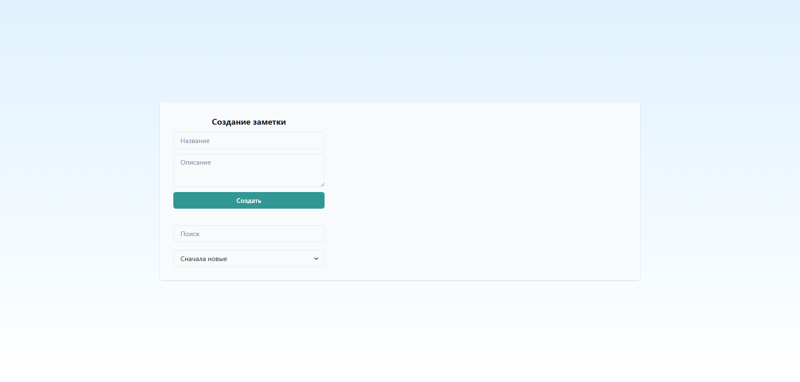
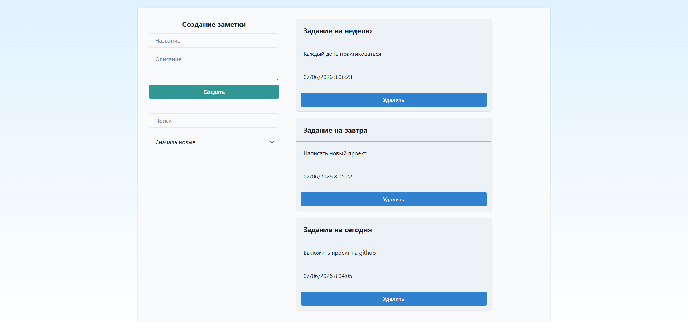
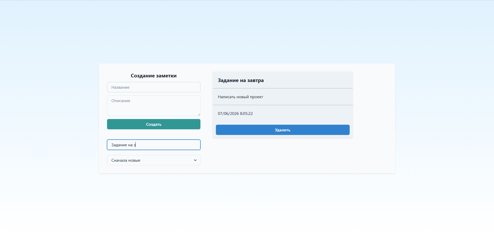

# NotesWebApp (ASP.Net Core Web Api + React) 📒

Web-приложение для создания/удаления и просмотра заметок пользователя.

## Быстрый старт 🚀

### Предварительные требования ⚙️
- ОС: Windows 10/11
- Backend: .NET 6.0+ SDK
- Frontend: Node.js 18+ и npm (скачать можно по ссылке: [Node.js](https://nodejs.org/en/download))
- IDE (рекомендуется): Visual Studio 2022, Visual Studio Code
- База данных: PostgreSQL 14+

### Установка и запуск 🔧
1. Скачайте архив или клонируйте репозиторий
    ```bash
    git clone https://github.com/BanCoder/NotesWebApp.git
    cd NotesWebApp
    ```
2. Настройка базы данных
   - Создайте базу данных в PostgreSQL
        ```sql
        CREATE DATABASE NoteDb;
        ```
   - Обновите строку подключения в `NotesWebApp/appsettings.json`
        ```json
        "ConnectionSettings": {
            "sqlConnection": "Server=localhost;Port=5432;Database=NoteDb; User Id=postgres; Password=your_password"
        }
        ```
     > **Важно:** Замените `your_password` на пароль, который вы задали при установке PostgreSQL
3. Применение миграций
   - Перейдите в папку с решением 
        ```bash
        cd NotesWebApp
        ```
    - Создайте и примените миграции
        ```bash
        dotnet ef migrations add InitialCreate --startup-project .\NotesWebApp --project .\DataAccess
        dotnet ef database update --startup-project .\NotesWebApp --project .\DataAccess
        ```
4. Запуск приложения:
    1. Backend (в терминале) или просто нажмите вверху на зеленый треугольник
        ```
        cd NotesWebApp\NotesWebApp
        dotnet run
        ```
        >***Примечание:*** Приложение должно запуститься на `https://localhost:5143`
    2. Frontend (в другом терминале)
        ```bash 
        cd NotesWebApp\notes.frontend
        npm install #если не установлено ранее
        npm start
        ```
        >***Примечание:*** Приложение запустится на `http://localhost:3000`

### Использование 📝
1. Откройте `http://localhost:3000` в браузере
2. **Создание**: Заполните поля "Название" и "Описание", затем нажмите на кнопку "Создать"
3. **Удаление**: Нажмите кнопку "Удалить" на заметке
4. **Поиск**: Введите текст в поле поиска 
5. **Сортировка**: выберите "Сначала новые" или "Сначала старые" в зависимости от того, как вы хотите отсортировать заметки

### Скриншоты 🖼️


*Главная страница*



*Создание заметок*



*Пример поиска заметки*

### Особенности ✅
- **Полный CRUD**: создание, чтение, обновление, удаление заметок
- **Поиск и сортировка**: фильтрация по тексту и дате создания
- **Валидация**: проверка обязательных полей на стороне сервера
- **CORS настроен**: frontend и backend общаются безопасно
- Возможность проверки выполнения запросов в Swagger
  
### Архитектура 🛠️
#### Технологический стек 💻 
`Backend`: 
- **Фреймворк**: .NET 8.0 Web API
- **ORM**: Entity Framework Core 8.0
- **База данных**: PostgreSQL с Npgsql
- **Миграции**: Code-First подход

`Frontend`: 
- **Библиотека**: React 19 с TypeScript
- **Стилизация**: Chakra UI компоненты + Tailwind CSS утилиты
- **HTTP клиент**: Axios для запросов к API
- **Форматирование дат**: Moment.js
- **Сборка**: Create React App

## Возможные проблемы 🔧
### Ошибка подключения к базе данных
- Убедитесь, что PostgreSQL установлен и запущен
- Проверьте пароль в строке подключения `appsettings.json`
- Выполните миграции (шаг 3)

### Ошибка при запуске фронтенда
- Убедитесь, что Node.js установлен: `node --version`
- Удалите `node_modules` и выполните `npm install` заново